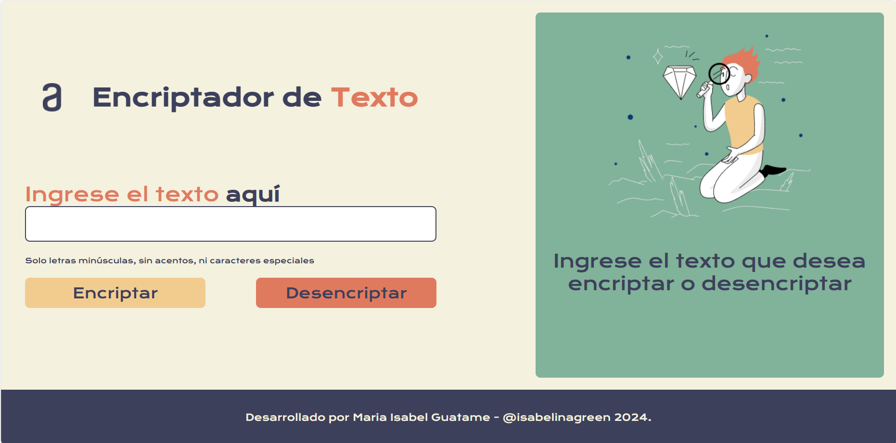

# Encriptador de Texto 🌱

## Índice
1. [Descripción del Proyecto](#descripción-del-proyecto)
2. [Estado del Proyecto](#estado-del-proyecto)
3. [Demostración de Funciones y Aplicaciones](#demostración-de-funciones-y-aplicaciones)
4. [Acceso al Proyecto](#acceso-al-proyecto)
5. [Tecnologías Utilizadas](#tecnologías-utilizadas)
6. [Personas Contribuyentes](#personas-contribuyentes)
7. [Personas Desarrolladoras del Proyecto](#personas-desarrolladoras-del-proyecto)
8. [Licencia](#licencia)

## Descripción del Proyecto
El **Encriptador de Texto** es una aplicación web diseñada para ofrecer un método sencillo y eficaz de encriptar y desencriptar mensajes. Con un enfoque en la sostenibilidad digital, esta herramienta se desarrolla con una paleta de colores que refleja la conexión con la naturaleza y un diseño accesible para todos.

## Estado del Proyecto

Este proyecto está en constante evolución, con actualizaciones frecuentes para mejorar su funcionalidad y rendimiento.

## Demostración de Funciones y Aplicaciones
Aquí puedes ver una demostración de cómo funciona la aplicación:

1. **Encriptar Texto**: Ingresa tu texto en el campo designado y haz clic en "Encriptar". El mensaje encriptado aparecerá en el área de presentación.
2. **Desencriptar Texto**: Selecciona el texto encriptado, cópialo, pégalo en el campo de texto y haz clic en "Desencriptar". El mensaje original se mostrará de nuevo.

## Acceso al Proyecto
Puedes acceder al proyecto desde el siguiente enlace: [Repositorio en GitHub](https://github.com/tu-usuario/tu-repositorio).

## Tecnologías Utilizadas
- **HTML5**: Estructura de la aplicación.
- **CSS3**: Estilos personalizados con una paleta de colores inspirada en la naturaleza (#E07A5F, #3D405B, #F2CC8F, #F4F1DE).
- **JavaScript**: Lógica para la encriptación y desencriptación del texto.

## Personas Contribuyentes
Agradecimientos especiales a quienes han contribuido a este proyecto:

- Nombre del Contribuyente 1 - [GitHub](https://github.com/contribuyente1)
- Nombre del Contribuyente 2 - [GitHub](https://github.com/contribuyente2)

## Personas Desarrolladoras del Proyecto
Este proyecto ha sido desarrollado por:

- **Maria Isabel Guatame** - Amante de los temas ambientales y sostenibles. Puedes encontrarme en [LinkedIn](https://www.linkedin.com/in/tu-usuario/) y [GitHub](https://github.com/tu-usuario).

## Licencia
Este proyecto está bajo la Licencia MIT - mira el archivo [LICENSE](./LICENSE) para más detalles.

---

🌿 Con un enfoque en la sostenibilidad y el respeto por la naturaleza, este proyecto refleja una visión donde la tecnología y el medio ambiente pueden coexistir en armonía.
